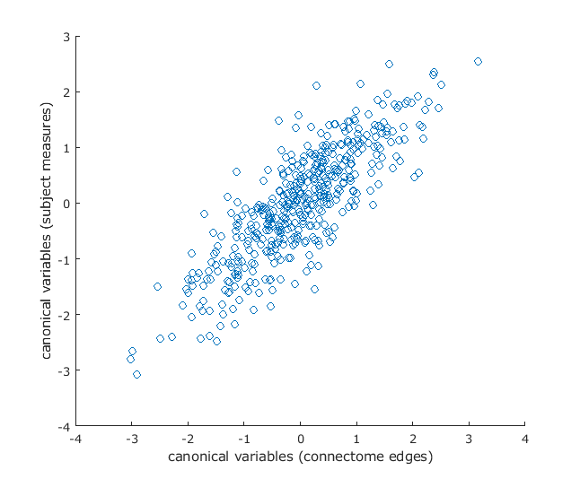
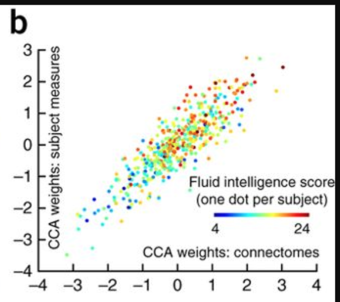
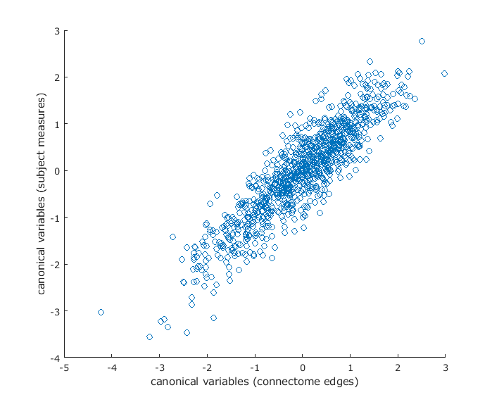

# *Human Connectome Project, CCA Analyses Documentation*

## GOALS

The purpose of this analysis is to:

**(1)** Replicate the results of [Smith et al 2015](https://www.fmrib.ox.ac.uk/datasets/HCP-CCA/).

**(2)** Run this analysis on the larger HCP 1200 patient dataset

**(3)** Create a clean, simple to use pipeline so others can replicate our analysis

**(4)** Expand this analysis to other connectome datasets

## File names and Checksum of files contents (computed with _md5 &lt;filename&gt;_ on Mac OS)
  - hcp_cca_analysis1.mat - c3478c29e60f3d62a87ecdeefd4672a0 (136864876 bytes)
  - hcp_cca_analysis2.mat - 650a7e34c52786c2da5c1c3c7def9300 (68583351 bytes)
  - hcp_cca_analysis3.mat - 22a21bb7c003b37322abf73f7267ce98 (123318709 bytes)
  
  - restricted_500_release.csv - 9374bf82ae119977ccb7816503a3b149 (309106 bytes)
  - restricted_1200_release.csv - f4c0de51deee3ae57fb90ecd46c543e0 (701178 bytes)
  - unrestricted_500_release.csv - 4a5faf47cb952acaca933b6c3a12bfaf (1000552 bytes)
  - unrestricted_1200_release.cscv - 39bf7c6cbf71df81397ad1654156ae64 (3522034 bytes)

## Accesssing the data used in these analyses
To simplify replication of these analyses (and if you do not wish to work from the raw HCP datasets), all necessary data to run each analysis documented on this page have been saved in a MATLAB workspaces.

These files are hosted on a Box account, and to request access please email nikhil.goyal@nih.gov with your name, institution, and explanation of why you are requesting access.

# *How to run these analyses on your own*

1. Clone this GitHub repo to your local computer
2. Download the .mat workspaces from the Box account (request access if you have not)
3. Move the .mat file to their respective folders, for example:
   - move _hcp_cca_analysis1.mat_ to analysis1/
4. Launch MATLAB, and load the .mat workspace corresponding to the analysis you want to run (ex. load _hcp_cca_analysis1.mat_ if you want to run Analysis 1)
5. Once the workspace is loaded, add the 'dependencies' folder to path, and open the correct .m script (ex. open _hcp_cca_analysis1.m_ if you want to run Analysis 1)
6. Run the MATLAB script, a scatter plot will be output (matching those found in this README)

# *Analyses*

## Analysis 2 (READ THIS FIRST) -  Attempt to replicate Smith et al. _exactly_ with 461 subjects
_All scripts for this analysis are located in analysis2/scripts_

**TO REPLICATE THIS ANALYSIS: you must use the _hcp_cca_analysis2.m_ script along with the _hcp_cca_analysis2.mat_ file.**

To exactly replicate the Smith et al study we used:
  - the rfMRI_Motion and quarter/release data provided on the [HCP-CCA site](https://www.fmrib.ox.ac.uk/datasets/HCP-CCA/)
  - the HCP 500 release netmat data to generate NET.txt (same as Analysis 1)
  - the restricted and behavioral files from the HCP 500 release (which should be the exact same as the data used in the Smith et al. study) (in Analysis 1, we used this data from the current release, which could differ from the HCP 500 release)

1. the NET.txt and vars.txt files were generated in the exact same manner as in Analysis 1 (except now with all 461 subjects used by Smith et al., and using slightly different Python scripts, located in analysis2/scripts/)
2. The same hcp_cca.m code was used for analysis
3. Running the code resulted in the following error:

```
Error using canoncorr (line 72)
X and Y must have the same number of rows.

Error in hcp_cca (line 82)
  [grotAr,grotBr,grotRp(j,:),grotUr,grotVr,grotstatsr]=canoncorr(uu1,uu2(PAPset(:,j),:));
```

The input matrix dimensions are:
   - _uu1_ 461x100
   - _uu2_ 461x100
   - _PAPset_ 458x10,000

It looks like the issue is with PAPset, which is generated by the following lines of code: (around line 25)
```
Nperm=10000; % in the paper we used 100000 but 10000 should be enough
EB=hcp2blocks('restricted_500_release.csv', [ ], false, vars(:,1)); % change the filename to your version of the restricted file
PAPset=palm_quickperms([ ], EB, Nperm);       
```

The matrix _EB_ has dimensions 458x5, and appears to be the source of error (the _vars_ matrix has the correct dimensions of 461x478).

It turns out that subjects are being dropped from the restricted data file because they are lacking elementary data necessary to generate the permutations. These subjects are: 108525, 116322, 146331, 256540.

**The MATLAB code was modified to drop these subjects from the analysis and proceed with the subset of 458.**


**The results of this analysis are as follows:**
  - Ncca (number of FWE-significant CCA components): 0
  - Scatter plot of the subject measure CCA weights vs. connectome CCA weights:
<p align="center">
  
</p>

But this is still not identical to the plot of SM weights vs. connectome weights in the Smith et al 2015 paper:
<p align="Center">
  
</p>

## Analysis 1 - Attempt to replicate Smith et al. (with 460 subjects)
_All scripts for this analysis are located in analysis1/scripts_

**TO REPLICATE THIS ANALYSIS: you must use the _hcp_cca_analysis1.m_ script along with the _hcp_cca_analysis1.mat_ file.**

**only 460 subjects were used (Smith et al. used 461) because subject 142626 was a duplicate - in a follow up analysis (Analysis 2, discussed below) we will try to exactly replicate with all 461 subjects and the restricted/behavioral data released in the HCP 500 dataset**

1. The subjects x partial connectome matrix was generated   
   - This matrix had to be created from the partial netmat information that is included in the HCP500 release. These are included as CIFTI files (.pconn.nii) which can be opened in HCP Workbench (specifically, in 'wb_view')
      - the specific files used were located in (these paths are from file struture of the dataset downloaded from HCP)
                    
            
            HCP500_Parcellation_Timeseries_Netmats/netmats_3T_Q1-Q6related468_MSMsulc_ICAd200_ts2.tar.gz
           
            
         _once you extract this file, a folder called 'netmats' is created, the actual CIFTI files needed are located in:_
            
            HCP500_Parcellation_Timeseries_Netmats/netmats/3T_Q1-Q6related468_MSMsulc_d200_ts2_netmat2
            
       - because the data is supplied as CIFTI files, HCP workbench's wb_command tool is used to convert them to .csv files
                
            _NOTE: There is a script included in this repo to accompish this, see [get_matrices.sh](https://github.com/Ngoyal95/HCP_CCA_Analysis/blob/master/analysis1/scripts/get_matrices)_
                
   - after generating the CSV files with 200x200 node edge weight data, a python script was used to generate a CSV text file (called 'NET.txt') containing the 460x199000 matrix, to be fed into CCA as in Smith et al.

2. The subject-measure matrix was created using the rfMRI and quarter/release data on the [HCP-CCA site](https://www.fmrib.ox.ac.uk/datasets/HCP-CCA/), the restricted and behavioral (unrestricted) datasets from HCP, and the list of subjectIDs and subject measures provided on that site
   - The resulting matrix was 460x478 (460 subjects, 478 subject measures as listed in the column_headers.txt file on the HCP-CCA site) and outputted to a CSV text file ('vars.txt')
3. The analysis was re-run using the provided hcp_cca.m [code](https://www.fmrib.ox.ac.uk/datasets/HCP-CCA/hcp_cca.m)
   - the following data was used:
      - the NET.txt file
      - the vars.txt file
      - the unrestricted data currently available from the HCP 1200 release (it contains info on 1207 subjects)
      - the restricted data currently available from the HCP 1200 release (contains info on 1207 subjects)
      - the quarter/release [varsQconf file](https://www.fmrib.ox.ac.uk/datasets/HCP-CCA/varsQconf.txt) provided on the HCP-CCA site
      - the [rfMRI_motion.txt](https://www.fmrib.ox.ac.uk/datasets/HCP-CCA/rfMRI_motion.txt) file provided on HCP-CCA site
   
   - the analysis ran successfully, resulting in the following plot of the subject measure CCA weights vs. connectome CCA weights:
   
**The results of this analysis are as follows:**
  - Ncca (number of FWE-significant CCA components): 0
  - Scatter plot of SM weights vs. connectome weights for canonical variables:
<p align="center">
  
</p>

However, this plot is NOT identical to the one in the Smith et al. paper. This could be due to a number of factors (different restricted or behavioral data since we used the data from HCP 1200, the duplicate subject removed)


## Analysis 3 - First attempt to expand the CCA analysis to the HCP 1200 dataset with al 478SMs (imputed missing data)
_All scripts for this analysis are located in analysis3/scripts_

**TO REPLICATE THIS ANALYSIS: you must use the _hcp_cca_analysis3.m_ script along with the _hcp_cca_analysis3.mat_ file.**

For this analysis, we lack the rfMRI_Motion and quarter/release (aka varsQconf) data used by Smith et al. These data will be substituted with 0's.

The following data were used:
  - HCP 1200 netmats (to generate the NET matrix, using the script _generate_NET_analysis3.ipynb_)
  - HCP 1200 behavioral and restricted datasets (to generate the subject measure matrix, using script _generate_vars_analysis3.ipynb_)
  - the [column_headers.txt](https://www.fmrib.ox.ac.uk/datasets/HCP-CCA/column_headers.txt) file from the [HCP-CCA site](https://www.fmrib.ox.ac.uk/datasets/HCP-CCA/) (so that the same subject measures are used)
  
Since Smith et al. provided the 478 Subject measures initially fed into the CCA, the vars matrix generated for this analysis uses all 478 measures (imputing missing data when necessary, ex. for the rfMRI_motion and quarter/release data).

Steps:
1. NET.txt and vars.txt were generated using the Jupyter Notebook scripts _generate_NET_analysis3.ipynb_ and _generate_vars_analysis3.ipynb_
2. The MATLAB script hcp_cca_analysis3.m was run 

**NOTE: the same issue with subjects being dropped is encountered (as in Analysis 2), so the _hcp_cca_analysis3.m_ script removes these subjects from our vars and NET matrices (subjects 122418, 168240, 376247)**


**The results are as follows:**
  - Ncca (number of FWE-significant CCA components): 12
  - Scatter plot of SM weights vs. connectome weights:
<p align="Center">
  
</p>

