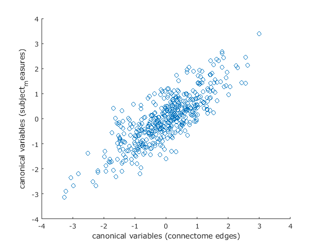

# Human Connectome Project, CCA Analyses

## GOALS

The purpose of this analysis is to:

**(1)** Replicate the results of [Smith et al 2015](https://www.fmrib.ox.ac.uk/datasets/HCP-CCA/).

**(2)** Run this analysis on the larger HCP 1200 patient dataset

**(3)** Create a clean, simple to use pipeline so others can replicate our analysis

**(4)** Expand this analysis to other connectome datasets

# DOCUMENTATION

## Analysis 1 - Attempt to replicate Smith et al. (with 460 subjects)

**only 460 subjects were used (Smith et al. used 461) because subject 142626 was a duplicate - in a follow up analysis we will try to exactly replicate with all 461 subjects and the restricted/behavioral data released in the HCP 500 dataset**

1. The subjects x partial connectome matrix was generated   
   - This matrix had to be created from the partial netmat information that is included in the HCP500 release. These are included as CIFTI files (.pconn.nii) which can be opened in HCP Workbench (specifically, in 'wb_view')
      - the specific files used were located in 
                    
            
            HCP_500_release/HCP500_Parcellation_Timeseries_Netmats/netmats_3T_Q1-Q6related468_MSMsulc_ICAd200_ts2.tar.gz
           
            
         _once you extract this file, a folder called 'netmats' is created, the actual CIFTI files needed are located in:_
            
            HCP_500_release/HCP500_Parcellation_Timeseries_Netmats/netmats/3T_Q1-Q6related468_MSMsulc_d200_ts2_netmat2
            
       - because the data is supplied as CIFTI files, HCP workbench's wb_command tool is used to convert them to .csv files
                
            _NOTE: There is a script included in this repo to accompish this, see "get_matrices.sh"_
                
   - after generating the CSV files with 200x200 node edge weight data, a python script was used to generate a CSV text file (called 'NET.txt') containing the 460x199000 matrix, to be fed into CCA as in Smith et al.

2. The subject-measure matrix was created using the rfMRI and quarter/release data on the [HCP-CCA site](https://www.fmrib.ox.ac.uk/datasets/HCP-CCA/), the restricted and behavioral (unrestricted) datasets from HCP, and the list of subjectIDs and subject measures provided on that site
   - The resulting matrix was 460x478 (460 subjects, 478 subject measures as listed in the column_headers.txt file on the HCP-CCA site) and outputted to a CSV text file ('vars.txt')
3. The analysis was re-run using the provided hcp_cca.m [code](https://www.fmrib.ox.ac.uk/datasets/HCP-CCA/hcp_cca.m)
   - the following data was used:
      - the NET.txt file
      - the vars.txt file
      - the unrestricted data currently available from the HCP 1200 release (it contains info on 1207 subjects)
      - the restricted data currently available from the HCP 1200 release (contains info on 1207 subjects)
      - the quarter/release [varsQconf file](https://www.fmrib.ox.ac.uk/datasets/HCP-CCA/varsQconf.txt) provided on the HCP-CCA site
      - the [rfMRI_motion.txt](https://www.fmrib.ox.ac.uk/datasets/HCP-CCA/rfMRI_motion.txt) file provided on HCP-CCA site
   
   - the analysis ran successfully, resulting in the following plot of the subject measure CCA weights vs. connectome CCA weights:
   

<p align="center">
  
</p>

However, this plot is NOT identical to the one in the Smith et al. paper. This could be due to a number of factors (different restricted or behavioral data since we used the data from HCP 1200, the duplicate subject removed)

## Analysis 2 -  Attempt to replicate Smith et al. _exactly_ with 461 subjects

To exactly replicate the Smith et al study we used:
  - the rfMRI_Motion and quarter/release data provided on the [HCP-CCA site](https://www.fmrib.ox.ac.uk/datasets/HCP-CCA/)
  - the HCP 500 release netmat data to generate NET.txt (same as Analysis 1)
  - the restricted and behavioral files from the HCP 500 release (which should be the exact same as the data used in the Smith et al. study) (in Analysis 1, we used this data from the current release, which could differ from the HCP 500 release)

1. the NET.txt and vars.txt files were generated in the exact same manner as in Analysis 1 (except now with the same 461 subjects used by Smith et al.)
2. The same hcp_cca.m code was used for analysis
3. Running the code resulted in the following error:

```
Error using canoncorr (line 72)
X and Y must have the same number of rows.

Error in hcp_cca (line 82)
  [grotAr,grotBr,grotRp(j,:),grotUr,grotVr,grotstatsr]=canoncorr(uu1,uu2(PAPset(:,j),:));
```

The input matrix dimensions are:
   - _uu1_ 461x100
   - _uu2_ 461x100
   - _PAPset_ 458x10,000

It looks like the issue is with PAPset, which is generated by the following lines of code: (around line 25)
```
Nperm=10000; % in the paper we used 100000 but 10000 should be enough
EB=hcp2blocks('restricted_500_release.csv', [ ], false, vars(:,1)); % change the filename to your version of the restricted file
PAPset=palm_quickperms([ ], EB, Nperm);       
```

The matrix _EB_ has dimensions 458x5, and appears to be the source of error (the _vars_ matrix has the correct dimensions of 461x478).
